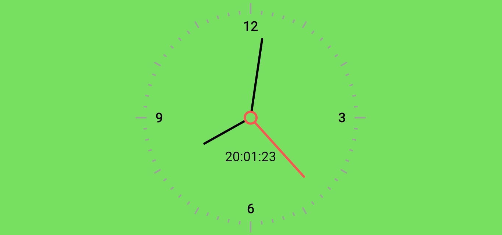

# Analog Watch App

A simple and attractive analog watch application built by flutter with builtin packages.


---

## Table of Contents

- [Features](#features)
- [Screenshots](#screenshots)
- [Tech Stack](#tech-stack)
- [Installation](#installation)
- [Usage](#usage)
- [Contributing](#contributing)

---

## Features

- **Time**: User can view the real time by analog and digital way with attractive design.


---

## Screenshots

### Main Page


---

## Tech Stack

- **Frontend**: Flutter
- **Backend**: Flutter builtin package

---

## Installation

### Prerequisites
- A modern web browser, mobile, desktop
### Steps

1. **Clone the Repository**

   ```bash
   git clone https://github.com/SaileshAcharya1229/analogclock
   cd analogclock

2. **Open the Application**
Open the main.dart file in vscode and select any preferred device to display the output.


## Usage
1. **view Time**: User can view realtime with both analog and digital way with attractive UI.

## Contributing
1. Fork the repository
2. Create a new branch (git checkout -b feature-name)
3. Commit changes (git commit -m "Add new feature")
4. Push to the branch (git push origin feature-name)
5. Open a Pull Request
